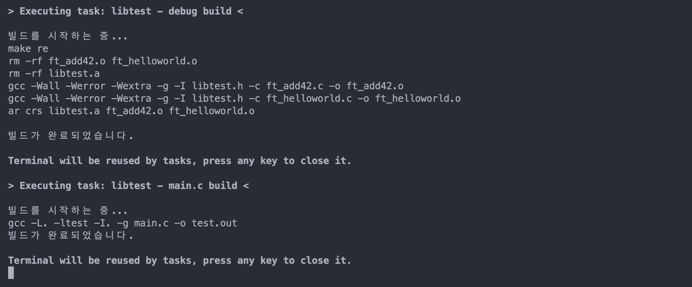

title: vscode에서 C debug 하기!
license: <span style="float: right; margin-right: 80px;"></a> by <a href="https://github.com/JaeSeoKim" >&copy;jaeskim</a>, <a rel="license" href="http://creativecommons.org/licenses/by-nc/4.0/"></a></span>
class: animation-fade
layout: true

.bottom-bar[
{{title}}
{{license}}
]

---

class: impact

# {{title}}

## 👋 good bye printf debug!

#### by JaeSeoKim(aka jaeskim)

???
NOTE: 발표대본

---

# 🗂 목차

- ## 😴 시작하기 전에...
- ## ✅ 준비물
- ## 📑 JSON 간단하게 알아보기!
- ## ⚙️ vscode debug 설정 파일 알아보기!
- ## 🏓 단일 c 파일 디버깅 설정 해보기!
- ## 🥊 c 프로젝트 디버깅 설정 해보기!

---

# 🗂 목차

- ## 🐛 디버그 기능 살펴보기!
- ## 🔗 참고 사이트!

---

# 😴 시작하기 전에...

- ## 혹시 디버깅을 할 때 printf를 사용하시는 분 있나요?

- ## 아니면 LLDB, GDB를 통해 CLI로 디버깅하시면서 불편함을 느낀 분 있으신가요?

--

> # 🚀 한번 **vscode**를 이용하여 GUI로 디버깅을 해보세요!

---

class: middle

# ⚖️ printf 디버깅과 vscode를 이용하여 디버깅 하는 모습을 비교 해봅시다!

---

## 🤬 vscode를 이용한 디버깅 방법 알기 전의 모습!


---

## 🤬 vscode를 이용한 디버깅 방법 알기 전의 모습에서 볼 수 있는 단점

- ### 특정 시점에 변하는 값과 내용을 보기 힘듬...
- ### 함수가 실행되는 콜스택를 보는 것이 힘듬...
- ### 일반 결과물과 같이 stdout으로 나오기 때문에 구분하기가 힘듬...
- ### 특정 시점의 변수의 값을 볼려면 전부 printf 해주어야 함...

---

## 🤩 vscode를 이용한 디버깅 방법 모습!

<div class="responsive">

</div>

---

## 🤩 vscode를 이용한 디버깅 방법 모습에서 볼 수 있는 장점!

- ### 단축키를 통해 빌드와 함께 바로 실행이 된다!
- ### BreakPoint 지점 상태의 변수의 값들을 알 수 있다!
- ### 오류가 발생위치를 알 수 있다!
- ### 콜스택를 볼 수 있다!
- ### 단축키와 GUI 버튼들을 이용하여 디버깅 제어가 가능하다!
- ### 작동중의 메모리의 값을 볼 수 있다!

---

# ✅ 준비물

- ## [vscode](https://code.visualstudio.com/)
- ## [C/C++ for Visual Studio Code](https://marketplace.visualstudio.com/items?itemName=ms-vscode.cpptools)
- ## C Compiler ([gcc](https://gcc.gnu.org/), [clang](https://clang.llvm.org/))
- ## C Debuer ([gdb](https://www.gnu.org/software/gdb/), [lldb](https://lldb.llvm.org/))

???
42seoul 클러스터에 기본으로 깔려있는 버전은 너무 구버전이에요 ㅠㅠ 최신버전으로 준비해주세요!

--

> macos 사용자 분들은 아래의 명령어 하나로 C Compiler와 Debuger 설치 가능합니다!
>
> `xcode-select --install`

---

# 📑 JSON 간단하게 알아보기!

.row[
.col-8.left[
JSON (Javascript Object Notation)은 key-value 쌍으로 이루어진 표준 포맷!

인터넷에서 자료를 주고 받기 위해 JavaScript 언어의 객체를 기반으로 만들어진 포맷으로 컴퓨터의 자료형을 표현하기 매우 쉬운 형태로 되어있습니다!
]

.col-4.center[

]
]

### 👩‍🎨 JSON 표현방법!

기본문법

```json
"데이터이름": 값
```

---

### 👩‍🎨 JSON 표현방법!

#### 지원하는 Type : `Number`, `String`, `Boolean`, `Object`, `Array`, `NULL`

#### 객체 표현 방법

```json
{
  "name": "jaeskim",
  "blackhole": 90
}
```

#### Array 표현 방법

```json
project : [
  "libft", "get_next_line", "ft_printf", "cub3D"
]
```

---

# ⚙️ vscode debug 설정 파일 알아보기!

vscode에서는 다양한 언어와 runtime들에 대해 debug를 지원하기 때문에 해당 환경에 맞는 extension 설치와 설정을 해주어야 합니다!

- C, CPP : [C/C++ for Visual Studio Code](https://marketplace.visualstudio.com/items?itemName=ms-vscode.cpptools)
- python : [Python extension for Visual Studio Code](https://marketplace.visualstudio.com/items?itemName=ms-python.python)
- C# : [C# for Visual Studio Code (powered by OmniSharp](https://marketplace.visualstudio.com/items?itemName=ms-dotnettools.csharp)
- Java : [Debugger for Java](https://marketplace.visualstudio.com/items?itemName=vscjava.vscode-java-debug)

이때 각 언어별 특성에 따라 Build 하는 과정이 있을 수도 있고 실행 할 때 인자를 주거나 어떤 Debuger를 통해서 작동하게 할지 등 세부 설정을 하기 위해서 `launch.json`, `tasks.json` 를 통해서 제어를 합니다.

---

## `tasks.json` ?

`tasks.json` 은 수행해야 하는 작업에 대해서 정의 하는 파일 입니다.

C 프로젝트를 기준으로는 `GCC` 통해 컴파일을 하거나, `make` 통해 프로젝트를 build 하는 등의 작업에 대해서 들어가게 됩니다.

## `launch.json` ?

`launch.json` 은 디버깅 타겟 프로그램 실행할 때에 대해서 정의 하는 파일입니다.

C 프로젝트를 기준으로 실행파일를 어떤 Debugger로 돌릴지, 어떤 인자를 넘기게 할 지 등등 여러가지 세부 조건에 대해서 정의를 할 있습니다.

---

# 🏓 단일 c 파일 디버깅 설정 해보기!

매우 간단한 팩토리얼 구하는 함수를 예시로 디버깅을 해보겠습니다!

```c
int	factorial(int n)
{
	if (n == 1)
		return (1);
	return (n * factorial(n - 1));
}

int	main(void)
{
	printf("%d\n", factorial(5));
	return (0);
}
```

---

## ✍️ tasks.json 작성하기!

해당 파일을 열어둔 상태에서 `f5` 를 눌러봅니다!


---

## ✍️ tasks.json 작성하기!

`C++ (GDB/LLDB)` 로 정의하게 되면 workspace에 아래와 같은 파일들이 생성되는 모습을 볼 수 있습니다.

```sh
$ tree -a .
.
├── .vscode
│   ├── launch.json
│   └── tasks.json
├── factorial.c
```

이제 여기서 `.vscode/tasks.json` 파일을 봅니다!

파일을 열어보게 되면 `"tasks"` 를 정의하게 되어 있는데 이 때 `[]` 통해서 작업들을 `Object Array` 형태로 정의한 다는 것을 볼 수 있습니다.

---

## ✍️ tasks.json 작성하기!

```json
"tasks": [
  {
    "type": "cppbuild",
    "label": "C/C++: clang 활성 파일 빌드",
    "command": "/usr/bin/gcc",
    "args": [
      "-g",
      "${file}",
      "-o",
      "${fileDirname}/${fileBasenameNoExtension}"
    ],
    "options": {
      "cwd": "${fileDirname}"
    },
...
```

---

## ✍️ tasks.json 작성하기!

파일을 간단하게 보면 평소에 터미널에 치던 `gcc` 명령어도 보이고 `-o` 옵션도 보이고 하지만 `${변수}` 형태로 되어 변수로 보이는 것들을 볼 수 있습니다.

`${변수}` 형태로 작성되어 있는 것들은 vscode에서 제공하여 주는 변수입니다.

### vscode 변수

`${file}` : 현재 열어서 보고 있는 파일 경로

`${fileDirname}` : 현재 열어서 보고 있는 파일이 존재하는 폴더 경로

`${fileBasenameNoExtension}` : 현재 열어서 보고 있는 파일의 확장자 제외한 이름

`${workspaceFolder}` : vscode가 열린 프로젝트 경로

---

## ✍️ tasks.json 작성하기!

`type` : 해당 task의 type를 정의 합니다! (ex. `cppbuild`)

`label` : 해당 task를 구분 할 수 있는 라벨을 정의합니다. (ex. `build factorial`)

`command` : 실행하는 커멘트를 정의합니다. (ex. `gcc`)

`args` : `command`의 인자에 대해서 정의 합니다. (ex. `-g`, `${file}`)

`options` : `cwd`, `environment`, `preLaunchTask` 등 다양한 옵션에 대해서 정의 합니다.

`problemMatcher` : task와 연결이 되는 문제에 대해서 정의 합니다. (ex. `$gcc`)

`group` : task의 그룹, default 여부 등을 정의 합니다.

`detail` : 해당 task에 대해서 저세하게 설명 합니다.

---

## ✍️ tasks.json 작성하기!

```json
"command": "/usr/bin/gcc",
"args": [
  "-g",
  "${file}",
  "-o",
  "${fileDirname}/${fileBasenameNoExtension}"
],
```

이제 기본 설정으로 되어 있던 부분을 보면 gcc 명령어를 통해 debug를 위한 옵션 `-g` 를 주어서 build를 하는 것을 볼 수 있습니다!

그리고 최종적으로 생성되는 파일은 `"${fileDirname}/${fileBasenameNoExtension}"` 으로 아까전에 `factorial.c` 파일을 기준으로 실행을 하면 `factorial` 실행 파일이 생성되는 것을 볼 수 있습니다!

---

## ✍️ launch.json 작성하기!

이제 `tasks.json` 설정을 통해 실행 파일이 만들어질 수 있게 되었으니 debug 실행에 대해서 정의 해봅니다!

`.vscode/launch.json` 파일을 보면 `tasks.jon` 과 유사한 구조로 `"configurations"` 를 `Object Array` 형태로 정의하는 것을 볼 수 있습니다!

--

```json
"name": "clang - 활성 파일 빌드 및 디버그",
"type": "cppdbg",
"request": "launch",
"program": "${fileDirname}/${fileBasenameNoExtension}",
"args": [],
"stopAtEntry": false,
"cwd": "${fileDirname}",
```

---

## ✍️ launch.json 작성하기!

일단 여기서 가장 중요하게 봐야 하는 부분이 있는데 `"preLaunchTask"` 부분 입니다.

정의 된 내용을 보면 아래와 같은데 이 때 `tasks.json` 에서 정의한 `label` 과 동일한 값이 들어 가는 것을 볼 수 있습니다.

이를 통해서 실행을 하기전에 수행되어야 하는 `task` 에 대해서 정의하는 것을 알 수 있습니다!

```json
"preLaunchTask": "C/C++: clang 활성 파일 빌드"
```

그리고 `"program"` 부분도 동일하게 `tasks.json` 에서 build한 파일을 실행을 하는 모습도 볼 수 있습니다.

```json
"program": "${fileDirname}/${fileBasenameNoExtension}",
```

---

## ✍️ launch.json 작성하기!

`"args"` 를 통해서 실행시의 인자를 배열 형태로 전달할 수 있는 것을 볼 수 있습니다!

```json
// ex_cmd ./cub3D map.cub
"args": ["map.cub"]
```

`"type"`, `"request"` 를 통해 다른 언어나 디버깅에 대해서 세부 제어가 가능하지만 현재는 기본값인 `cppdbg`, `request`로 사용하면 됩니다.

```json
"type": "cppdbg",
"request": "launch",
```

---

## ✍️ launch.json 작성하기!

`"stopAtEntry"` 옵션은 초기 Debug를 시작을 할 때 main 시작에서 멈추는지에 대해서 설정하는 옵션입니다!

breakpoint를 설정안하고 처음부터 로직을 살펴볼 때 유용합니다!

`"cwd"` 은 실행을 할 때 작업 경로를 지정하는 옵션입니다.

보통 `${workspaceFolder}` 를 자주 사용합니다.

```json
"cwd": "${fileDirname}",
```

`"environment"` 는 이제 실행을 할 때 전달이 되어야 하는 환경 변수에 대해서 정의 합니다.

---

## ✍️ launch.json 작성하기!

이때 아래와 같은 형태의 `Object Array` 형태로 정의하게 됩니다!

```json
"environment": [
  {
    "name": "HELLO",
    "value": "world!"
  }
],
```

`"externalConsole"` 옵션을 통해 외부 터미널을 통해 디버깅을 실행하는 것이 가능합니다.

외부터미널을 사용하면 입력을 직접 넣어볼 수 있는 장점이 있습니다.

```json
"externalConsole": false,
```

---

## ✍️ launch.json 작성하기!

`"MIMode"` 를 통해 `gdb`나 `lldb`로 실행을 할지에 대해서 정의가 가능합니다.

```json
"MIMode": "lldb",
```

그리고 `"osx"`, `"linux"`, `"windows"` 옵션을 통하여 각 운영체제별 실행 옵션을 제어도 가능합니다.

```json
"MIMode": "lldb",
"linux": {
  "MIMode": "gdb"
},
```

---

# 🥊 c 프로젝트 디버깅 설정 해보기!

방금전에 해본 단일 c 파일 디버깅은 기본 `f5` 으로 초기설정한 부분만으로도 사용이 가능하지만 `42seoul`에서는 특정 라이브러리를 만들거나 규모가 있는 c 프로젝트를 진행하기 때문에 이번에는 `make` 명령어를 활용하여 디버깅를 해봅니다!

> ### 🐙 아래의 Git 주소에서 example를 Clone 받아주세요!

> https://github.com/JaeSeoKim/c_project_vscode_debug_example

Clone후 `.vscode` 경로의 설정을 지워주세요!

해당 예제는 간단한 2개의 함수를 가지고 있는 라이브러리 `libtest.a` 를 build 하는 프로젝트 입니다!

이 프로젝트를 가지고 예시를 작성해보겠습니다!

---

# 🥊 c 프로젝트 디버깅 설정 해보기!

일단 `makefile` 를 확인 해봅니다!

```makefile
NAME = libtest.a
# ... 생략 ...
ifeq ($(DEBUG),true)
CFLAGS += -g
endif
# ... 생략 ...
%.o : %.c
	$(CC) $(CFLAGS) -c $< -o $@
# ... 생략 ...
.PHONY: all clean fclean re
```

---

# 🥊 c 프로젝트 디버깅 설정 해보기!

일단 해당 target를 살펴 보면 `all clean fclean re` 와 같이 기본적인 target들이 명시 되어 있는 것 을 볼 수 있습니다!

또한 Object로 Build 할때에는 `$(CC) $(CFLAGS) -c $< -o $@` 와 같이 간단한 형태로 Build를 하고 있는 모습도 볼 수 있습니다!

이 때 Object를 build 할 때 **debug**을 위해 옵션 `-g` 를 추가해주어야 하는데 항상 `-g` 플래그가 추가되면 안되기 떄문에 아래와 같이 환경 변수를 이용하여 추가가 가능하도록 합니다!

```makefile
ifeq ($(DEBUG),true)
CFLAGS += -g
endif
```

---

## ✍️ tasks.json 작성하기!

한번 환경변수 `DEBUG` 를 `true` 로 주면서 make 해주는 `task`를 작성해봅니다!

--

```json
{
  // ... 생략 ...
  "command": "make",
  "args": ["re"],
  "options": {
    "cwd": "${workspaceFolder}",
    "env": { "DEBUG": "true" }
  }
  // ... 생략 ...
}
```

---

## ✍️ tasks.json 작성하기!

방금전에 작성한 부분을 자세히 살펴보면 `command` 는 `make`로 주어서 저희가 미리작성한 make 작업을 수행 할 수 있도록 하고 `args` 로는 `re` 인자를 넘겨주어서 re 역할을 수행 할 수 있는 것을 볼 수 있습니다!

그리고 가장 중요한 **`options`** 부분을 보면 `"env": { "DEBUG": "true" }` 와 같은 형태로 작업을 진행 할 때 환경 변수 `DEBUG` 를 `true` 로 설정해 주는 것을 볼 수 있습니다!

이 부분을 통해서 libary를 **Debug** 용으로 Build 할 수 있는 task를 작성 한 것을 확인 할 수 있습니다!

이제 debug용으로 build된 `libtest.a` 파일이 있으니 테스트 코드와 함께 build를 해서 실행파일을 만드는 `task` 를 작성해봅니다!

---

## ✍️ tasks.json 작성하기!

프로젝트 내부에 `main.c` 라는 간단한 테스트 코드가 있는데 이것을 이용하여 실행파일을 만드는 `task` 를 작성합니다.

--

```json
{
  // ... 생략 ...
  "command": "gcc",
  "args": ["-L.", "-ltest", "-I.", "-g", "main.c", "-o", "test.out"],
  "options": {
    "cwd": "${workspaceFolder}"
  },
  "dependsOn": ["libtest - debug build"]
  // ... 생략 ...
}
```

---

## ✍️ tasks.json 작성하기!

작성한 내용을 보면 간단하게 `gcc` 명령어를 통해서 `libtest.a` 파일을 이용하여 `main.c` 를 디버깅용 실행 파일로 만드는 것을 볼 수 있습니다.

이 떄 중요한 부분은 바로 `libtest.a` 파일이 debug 용으로 build 되어야 하는 부분인데 `dependsOn` 항목을 이용하여 방금전에 정의 했던 `task` 작업을 명시 해줌으로 이 작업이 실행되기전에 해당 `task` 를 실핼 할 수 있게 됩니다!

실제로 task를 실행 해보면 다음과 같이 작업을 진행하는 모습을 볼 수 있습니다!

---

### 🔨 Task 작업이 진행된 모습!

<div class="responsive" >
  
</div>

---

## ✍️ launch.json 작성하기!

이제 테스트용으로 Build된 실행 파일을 vscode에서 실행 할 수 있도록 설정 합니다!!!

```json
{
  "name": "libtest - main.c exec",
  "type": "cppdbg",
  "request": "launch",
  "program": "${workspaceFolder}/test.out",
  "args": [],
  // ... 생략 ...
  "preLaunchTask": "libtest - main.c build"
}
```

위와 같이 build된 실행파일에 대해서 정의를 해주고 `preLaunchTask` 항목을 아까전에 정의한 `task` 로 설정 합니다!

---

## ✍️ launch.json 작성하기!

이제 `F5` 눌러서 디버그를 실행하면 아래와 같이 디버그가 가능한 상태가 보이는 것을 볼 수 있습니다!

<div class="responsive">
  
</div>

---

- # 🐛 디버그 기능 살펴보기!

이제 vscode 디버깅 설정 하는 방법에 대해서 알게 되었으니 이제 디버그 기능에 대해서 자세히 알아봅니다!

<div class="responsive">
  
</div>

---

- ## 🚦 BreakPoint!

---

# 🔗 참고 사이트!

- [vscode-debugging](https://code.visualstudio.com/docs/editor/debugging)
